# SearcHRight AI Technical Assignment

## 목표

> **_회사, 재직기간, 직무(타이틀) 만 존재하는 인재 데이터를 기반으로 LLM 을 활용하여 어떤 경험을 했는지, 어떤 역량을 가지고 있는지 추론하기_**

1. 인재 데이터 example 3건 제공합니다.
2. 그 인재 데이터들의 회사 데이터 (뉴스, 재직자 수 변동, 자본금 변동, 투자 라운드 정보) 제공합니다.
   - 만약 더 필요하다면, 외부 데이터를 추가하거나 합치는 것은 상관 없습니다.
   - 원본 데이터를 변형해도 무방합니다.
   - **하지만 추가 또는 변동한 데이터에 대한 "객관적인 사실" 정보가 필요합니다. (출처 등)**
3. LLM 중 OpenAI의 token 제공합니다.
   - 혹시 모를 탈취, 이슈, 보안 등의 이유로 토큰 사용 비용은 $20으로 제한되어 있습니다.
   - 만약 더 필요하다면 부담 없이 아래에 안내된 이메일 또는 안내 받은 유선 번호로 연락 부탁드립니다. 
4. 위 3번 토큰으로 사용이 허용된 API (GPT RestAPI 기준)는 아래와 같습니다.
   - `/v1/models`
   - `/v1/audio`
   - `/v1/chat/completions`
   - `/v1/embeddings`
   - `/v1/images`
   - `/v1/moderations`

## 세부 사항

### 1) 기본 input 과 output flow

```mermaid
flowchart LR
    A[인재데이터 - ***json***] --> B[API 요청]
    B --> C[***LLM 기반 경험 판단 시스템***]
    C --> D[경험값 출력]
    D --> J[초기 스타트업 경험<br />빅테크 경험<br />글로벌 런칭 경험<br />기술 리더십 경험<br />B2C/B2B 도메인 경험<br />물류 도메인 경험 ...]
```



#### *"LLM 기반 경험 판단 시스템" 내부 로직*

```mermaid
flowchart LR
    A[인재 데이터 전처리] --> B

    subgraph 벡터 검색 프로세스
    B[벡터 검색 쿼리 생성] --> C[벡터DB 검색 및 문서 추출]
    end

    C --> D[LLM 컨텍스트 구성]
    D --> E[경험 태그 추론]
    E --> F[결과 후처리]
```

### 1) 사전 세팅 및 사용하기

> 가상환경과 docker compose 를 실행한 상태에서 아래 커멘드, 사전 세팅을 F/U 해주셔야 정상 작동 합니다.

1. `example_datas` 경로로 이동한 상태에서 아래 스크립트를 차례로 실행해 주세요.
2. `python ./setup_company_data.py`
3. `python ./setup_company_news_data.py`
4. `cd ..` 하고, 아래 스크립트를 차례로 실행해주세요.
5. `python llm_internal_api.py` 

   `(port: 9000, POST: /llm/embedding, /llm/tagging)`
6. `python main.py` 

   `(port: 8000, POST: /api/db/search-talents, /api/db/upload-talents, /api/infer/extract-tags)`
7. 일부 로직의 테스트는 `pytest` 라이브러리를 별도로 설치한 다음, `/tests` 에서 `pytest`로 단번에 가능합니다.

### 2) 구조도
```
📦 
├─ llm_internal_api.py
├─ main.py
├─ nginx
└─ src
   ├─ __init__.py
   ├─ api_config.py
   ├─ api_utils.py
   ├─ database
   │  ├─ db_config.py
   │  ├─ db_lifespan.py
   │  ├─ db_utils.py
   │  ├─ sql_creates.py
   │  └─ sql_inserts.py
   ├─ llm
   │  ├─ llm_config.py
   │  ├─ llm_inference.py
   │  ├─ llm_lifespan.py
   │  └─ llm_utils.py
   ├─ routers
   │  ├─ llm_router.py
   │  ├─ tag_extraction.py
   │  ├─ talent_search.py
   │  └─ talent_upload.py
   └─ tests
      ├─ __init__.py
      ├─ _test_main.py
      ├─ mocking_internal_server.py
      ├─ search_logic.py
      ├─ test_get_embedding.py
      ├─ test_infer_tags.py
      └─ test_map_positions.py
```
©generated by [Project Tree Generator](https://woochanleee.github.io/project-tree-generator)
- `/database`: DB를 다루기 위한 코드
- `/llm`: LLM의 embedding 및 tagging에 필요한 코드
- `/routers`: 관리를 용이하게 하기 위해 API 실행 파일에서 분리한 라우터들
- `/tests`: 일부 로직의 검증 및 API 통신을 점검하기 위한 코드

### 3) 구현 QnA


